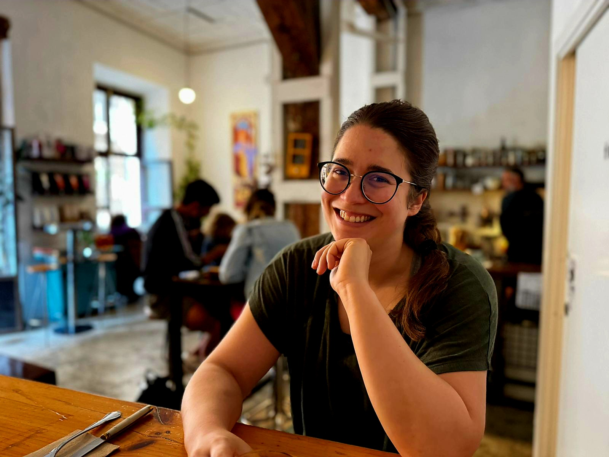
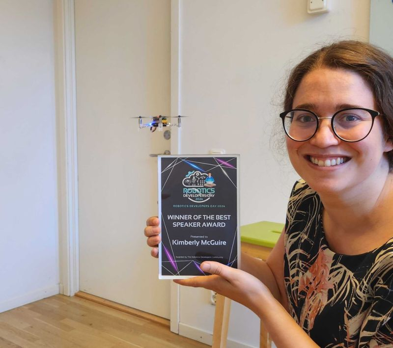

<script data-goatcounter="https://knmcguire.goatcounter.com/count"
async src="//gc.zgo.at/count.js"></script>


[{width=100}](first_blogpost.md)

_Here is my first blogpost on my new website! It will be a little bit about me, about my professional live, and a bit how I build this website. (or maybe a lot who knows). Enjoy!_

<!-- more -->

# Hello World!

So... here we are, my first blog post! Well... not exactly my first blog post since I've written [over 70 blog posts during my time at Bitcraze](https://www.bitcraze.io/author/kimberly/), so I guess I'm not exactly a 'beginner'. But since I no longer work there and am now out in the big world... perhaps it would be good to have a central space to record some of my weird, random, but maybe useful to someone, thoughts. [LinkedIn](https://www.linkedin.com/in/knmcguire/) is a good place for that, but maybe not everything is equally suitable for that platform. Just as not all LinkedIn-type posts would be suitable for [X](https://www.x.com/k_n_mcguire/) or [Mastodon](https://fosstodon.org/@k_n_mcguire) either. So here you go, a neutral ground for blog posts where I can share all the cool projects I'm working on, some personal journeys, and perhaps some artwork here and there. Then afterwards, I can always decide on which social media platform it will be suitable for.


<center>{ width="300" } <br>
_Me on a holiday in Madrid Autumn 2024_</center>


## A Little About Me *

*_or maybe a lot... anyway, it's my blog, so I'll do whatever I want :wink:_

So, if you have stumbled upon this website by chance without ever having heard of me - nice to meet you, my name is Kimberly. 
 I'm a Dutch/American woman who spent her entire childhood and early adult life in The Netherlands but now lives in Malmö, Sweden. In the last 5 years, I have convinced my current husband and my two cats to come and join me, and we bought an apartment together. I adore Japanese food and karaoke (some of you might know me as Karaoke-Kim). For a few years now, I have started to focus more on my health. Before, I was more crazy about food and travel, but after I had a cancer diagnosis 2 years ago, it changed my priorities a bit. So I regularly do boxing as exercise with resistance training and focus on eating healthy. This way, I can handle some cheats when I'm traveling somewhere :slight_smile:. When the weather is nice, I like to go on hikes/long walks, and when it's cold, I like to do graphic design/drawing and video gaming.

I grew up near Amsterdam (a small town called Hoofddorp), but I've studied for a long time at Delft University of Technology. I mostly skipped faculties since I've studied Industrial Design Engineering for my Bachelor's, Biomechanical Design Engineering for my Master's, and finally did my PhD at the faculty of Aerospace Engineering. That PhD got me into contact with my former employer Bitcraze, which started me on my Swedish adventure to Malmö in 2019. I have been doing internships and jobs for longer durations during my studies, like NEC in Japan, Hospitality in Santa Barbara, California, and offsite research in Liverpool, so I guess I've seen a bit and lived in several parts of the world already. That's probably why it wasn't too difficult of a decision to come and live here, but of course, moving to different countries is not to be underestimated, even if it's within Europe.

## A Little About Me Professionally

So I am a robotics engineer, and for my PhD, I focused on swarm robotics with small drones. That got me into contact with Bitcraze to come and work for them with the Crazyflie. I first started out with more embedded software engineering, but a few years in, I focused more on robotic integration and simulation and started working with ROS and Gazebo again. After meeting Ramon Roche from Dronecode at [ROSCon 2022 Kyoto](https://roscon.ros.org/2022/), we decided to start up the [community interest group for ROS in Aerial Robotics](https://github.com/ROS-Aerial)s, and we are still organizing meetings every month (there is [one meeting next week](https://discourse.ros.org/t/aerial-robotics-meeting-february-20th-2025/42012) if you are interested!). Also, I co-maintain the Crazyswarm2 project together with Wolfgang Hönig. Two things I'm pretty proud of are the Best Speaker award I got for the [Robotics Developer Day talk I did in 2024](https://youtu.be/rtgt9Z1cPas), and the [Science Robotics paper](https://robotics.sciencemag.org/content/4/35/eaaw9710) I published at the end of my PhD.

<center>{ width="300" } <br>
_The prize I won last summer_</center>

Other than that, I've recently noticed I love communicating and working together with external collaborators. I guess that is why I helped start the ROS-aerial group, and so far, I've been part of multiple committees to organize workshops and developer rooms at ICRA, RSS, and FOSDEM. When I was still working at Bitcraze, I would talk with researchers a lot and occasionally visit them. Sometimes I do get a bit overenthusiastic and try to help wherever I can, but that is perhaps a part of me that I sometimes need to control. Can't help everyone with all their projects, so I'll have to learn how to prioritize what I'd like to do and where my skills would be the most suitable. And that latter is quite difficult if you have impostor syndrome like me (they will come for my diplomas one day, I just know it!). Luckily I found out that I'm not the only one with this affliction.

## How Did I Make the Website and Blog?

I had a website before, built with Jekyll, the recommended way to startup GitHub pages, but I wasn't really happy with it. I do find it satisfying to work on it, but I don't love web development that much to keep tweaking and optimizing everything... until I heard from my old colleague Rik about [Mkdocs](https://www.mkdocs.org/). After using it for the [Aerial Robotics Landscape](https://ros-aerial.github.io/aerial_robotic_landscape/), I decided to give it a go for my personal website, particularly [Materials for Mkdocs](https://squidfunk.github.io/mkdocs-material/). Technically it is not really made for personal websites, but it was so easy to set up and it looks so clean! And it also has a blogging plugin, as you see here right now. Although I haven't enabled the RSS function yet as I don't really know if this is... blogging ... really becoming a regular thing. Perhaps I'm too late in the game and should be starting a TikTok account ...

(_p.s. I've added a RSS feed now, it was just too easy! It's [https://knmcguire.github.io/feed_rss_created.xml](https://knmcguire.github.io/feed_rss_created.xml)_  )

What I retained is mostly the content of my old website. I also use [GoatCounter](https://www.goatcounter.com/), which is a privacy-friendly way for me to track which pages are being watched. It's an open-source web analytics tool that doesn't use cookies for tracking, so that sounds pretty good to me as I only want to know if I'm not just shouting into the void here. You can find the source of [this website over there](https://github.com/knmcguire/knmcguire.github.io) if you are interested in making something like this for yourself. Also, there is a way to leave a comment on this blog post connected to GitHub discussions through Giscus, which is a pretty awesome feature.

Also I kept these buttons! These are not part of the Materials theme but I liked them very much, so I'm currently just adding them in just html code. Here is the source but I might include these to the style sheet of .css. 


```html
<a href="https://knmcguire.github.io/"><button style="background-color: #E8E8E8;
        border: 2px solid black;
        color: black;
        padding: 15px 32px;
        text-align: center;
        text-decoration: none;
        display: inline-block;
        font-size: 16px;
        width: 100%; 
        cursor: pointer">click click</button></a>
```
This results in:
<a href="https://knmcguire.github.io/"><button style="background-color: #E8E8E8;
        border: 2px solid black;
        color: black;
        padding: 15px 32px;
        text-align: center;
        text-decoration: none;
        display: inline-block;
        font-size: 16px;
        width: 100%; 
        cursor: pointer">click click</button></a>


## So What's Next?

So, what is my current state? I left Bitcraze 2 months ago, and now I'm on a bit of a break-mini-retirement-sabbatical-traveltonepal-but-home, while building websites and writing blog posts, apparently. The last few years have been tough both health-wise and professionally, so this is a time I can use to self-reflect and see what my next steps are. Will I start something for myself or go work for another company, stay in robotics or go back to university? Who knows? At least I have some mental space to start thinking about it all, and I must say that I've gained a lot of new and creative ideas by having this rest already.

So I'm not sure how far I will take this blog, how occasional it will be, or what topics it will cover. This blog post is obviously not very technical (hence the category 'personal'), but I now have a space to store any tutorials or guides I make in the future. Or maybe people would like to see something personal about me as well. Who knows?

Anyway, I hope you'll be able to enjoy it. And please try out the GitHub comment function below! I want to see how it works :smile:!

