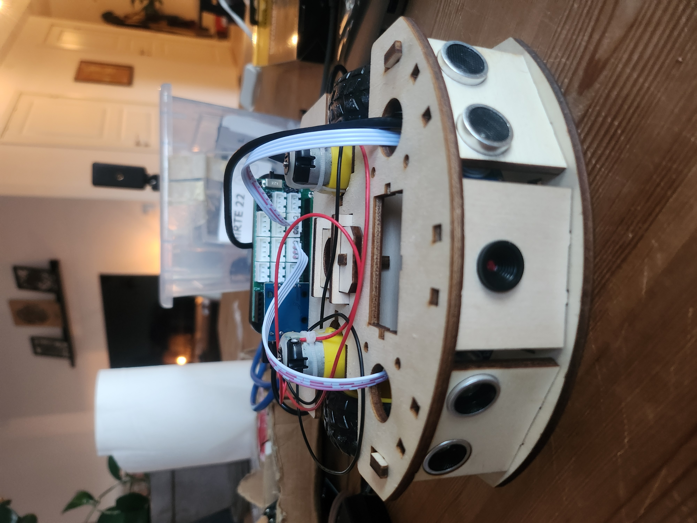
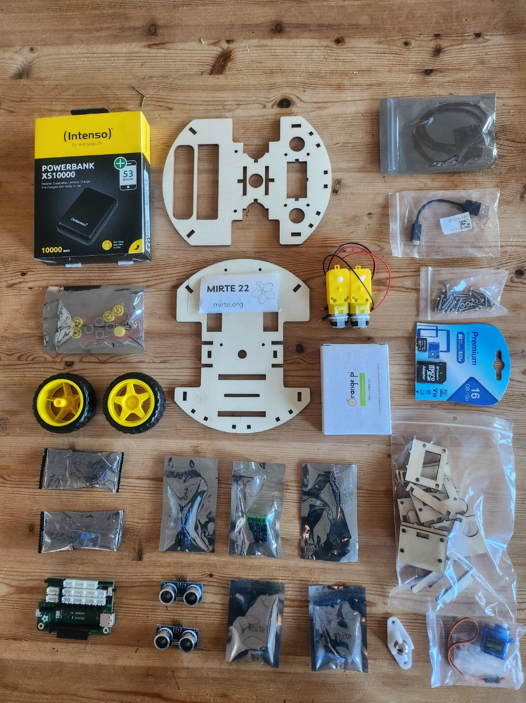
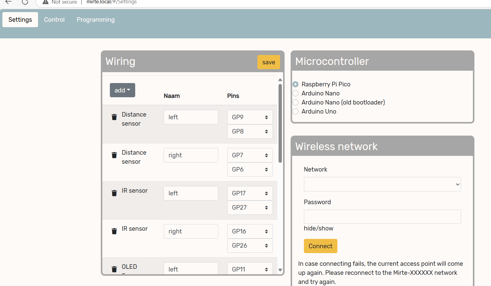

<script data-goatcounter="https://knmcguire.goatcounter.com/count"
async src="//gc.zgo.at/count.js"></script>


[{width=100}](mirte_part_1.md)

_I've spent some days building the low-cost open-source educational robot developed by TU Delft! Here is a short blog post describing that experience and some ideas and plans for projects I could possibly do with it. It's an awesome platform._

<!-- more -->

So, when I decided to take a little career break before starting anything new, I had a whole list of things and projects that I'd like to do. Although I've done quite a few creative projects, at one point I wanted to make something physical, with sensors that move—a robot, perhaps? I'm very glad that on a previous trip to my old university town, Martin Klomp lent me building materials to build the [MIRTE](https://mirte.org/), a fully open-source robot that TU Delft has developed for educational purposes.

I know Martin from my time on the organizing committee of the RoboCup Junior (NL) competition in the Netherlands back in 2019 and this project stems from the shared experience of needing a good standard mobile robot for kids and students alike. This platform will be used in TU Delft's university robotics classes as well, so I'm excited to see what it is all about.


## Building  MIRTE

<center>{ width="300" }</center>

So, I got the building materials for the MIRTE Pioneer, but there are other versions as well that have fewer capabilities but are more suitable for kids or students who are just getting started. I've made a picture of everything that came in the box, which are all (almost) off-the-shelf components. The version I had did include the 'MIRTE PCB,' for which the KiCad files are available under the CERN open hardware license, but the [MIRTE website](https://mirte.org/) also provides instructions to connect all the sensors through wires and a breadboard. Additionally, I've received a whole bunch of sensors like sonar, camera, infrared sensors, and some screens. How will it all fit!

<center>{ width="300" }</center>

So once I had investigated all the materials, I followed the building instructions on the [MIRTE website](https://mirte.org/). The visual instructions made it quite easy to put things together. But I was more impressed with the clever design of the base itself. The Orange PI board and the MIRTE PCB were attached with screws along with some sensors, but the base itself could be assembled without using even one screw. Even the motors for the wheels could be easily clicked into place. Also, in the front part of the base, there were modules for the sensors that could be clicked in facing forward and changed to other sensors depending on the application of the project. This is a very handy feature.


<center>{ width="300" }</center>

Here is a video of the full build:

<center><iframe width="560" height="315" src="https://www.youtube.com/embed/JcqcggjcqF8?si=GLnWwj4mbfMycYdx" title="YouTube video player" frameborder="0" allow="accelerometer; autoplay; clipboard-write; encrypted-media; gyroscope; picture-in-picture; web-share" referrerpolicy="strict-origin-when-cross-origin" allowfullscreen></iframe></center>

## Connecting and driving MIRTE

So once I had inserted the flashed SD card, I was able to connect with MIRTE since it initializes as a WiFi access point. The web UI is where I could input the SSID and password of the access point that I'd like the MIRTE to connect to instead. Since I am currently running Windows (yeah yeah, I know the torture I put myself through), I'll skip it for now because I know what kind of network issues I'll be getting with that, and I want to get driving right away!

<center>{ width="400" }</center>

In this web UI, I can also test the sensors. I've attached 2 distance sensors on the sides and one camera. The camera isn't shown on the GUI yet, but I can already test out the right and left distance sensors. Additionally, it contains a simple control panel so that I can remote control the MIRTE and chase my cats!

I was about to quit here and leave the MIRTE on a shelf while I think about the next project... but then late at night, I woke up in a cold sweat where my unconscious robotic side said: NO WAY! I can't just leave it hanging as a remote-controlled car... let's at least connect those sensors to something!

Since there are 2 distance sensors on each side of the front bumper, this is the perfect opportunity to make a Braitenburg robot, which is literally 2 lines of logic (or 2 blocks for Blockly). MIRTE has an API for Blockly, Python, and ROS1, but I'll stick with Python for now and wait for the ROS 2 version to come out (this will be somewhere in 2025). It is also possible to edit this all in MIRTE's WebGUI.


```python
max_speed = 50 # percentage speed
while True:
  left_dist = mirte.getDistance('left')
  right_dist = mirte.getDistance('right')
  right_motor_speed = round(min(max(left_dist, 1), max_speed))
  left_motor_speed = round(min(max(right_dist, 1), max_speed))
  mirte.setMotorSpeed('right', right_motor_speed)
  mirte.setMotorSpeed('left', left_motor_speed)
```

And that is what a Braitenburg robot is, where the sensors are directly connected to the actuators. This is as simple as a robot can be. But with this setup, it can already avoid most of the obstacles (and cats) in the room! The distance sensors don't have a very large field of view, so there is a dead spot right in front of it (like the table leg and the chair leg it ran into at the end). But as long as it goes at a slow speed, there is usually no harm to MIRTE. That is how easy robotics can be.

See here the full video of testing the distance sensors and wheels, and making the MIRTE drive autonomously based on a Braitenburg vehicle control.


<center><iframe width="560" height="315" src="https://www.youtube.com/embed/CBb7-vnnBmc?si=iLKSgSTNvPmbG5Hd" title="YouTube video player" frameborder="0" allow="accelerometer; autoplay; clipboard-write; encrypted-media; gyroscope; picture-in-picture; web-share" referrerpolicy="strict-origin-when-cross-origin" allowfullscreen></iframe></center>

## Conclusion and what is next?
So I'll leave the MIRTE alone after that (tiny) crash since I need to figure out how to access the camera and think about what other sensors I can add. For instance, I do have an AOK-D Lite camera and a small lidar I can put on top. And how about a small arm or gripper? So many possibilities, but I'll wait until my unconscious roboticist wakes me up in the middle of the night with a good plan. But all in all, the MIRTE is a really nice platform, and the base is quite sturdy as well. The web UI to control it and define the sensors is very well thought out too. The project is still in development, and I'll make sure to share my notes for improvement with the developers (or contribute). But I can't wait for the ROS 2 packages to come out for this robot so that I can connect it with NAV 2, Gazebo harmonic, or have a Crazyflie land on it perhaps?

If you want to check it out, all of the build plans are open-sourced and can be found on [mirte.org](https://mirte.org/). The full base can be laser-cut out of 4 mm MDF and configured to accommodate other sensors as well[^1]. Thanks again to Martin Klomp from [TU Delft](https://www.tudelft.nl/) for lending me the [MIRTE](https://mirte.org/). It was fun and I hope to do more cool projects with it soon!

[^1]: 
  I kind of really want to buy a laser cutter for myself now, in fact... anyone know of a good model for home/hobby use by any chance?
