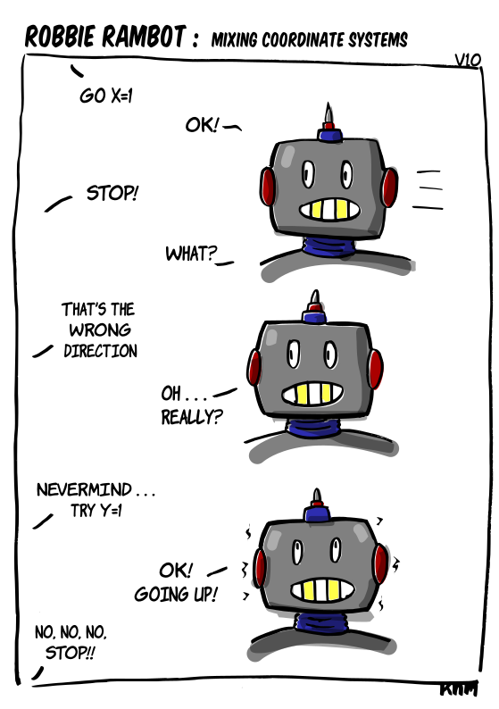

[{width=100}](robbie_coordinate_systems.md)

*This happens so many times! I think my prototype robot is using the camera coordinate system again... or am I wrong?* 

*Enjoy!*

<!-- more -->

![Web comic with 3 panels with as title 'Robbie: Mixing Coordinate system'. In the first panel, an offscreen developer tells the robot to go 'X=1', the robot (Robbie Rambot) says 'OK!. Then the offscreen developer says 'STOP!'. 'What?' asks Robbie. On the second panel it says'That's the wrong direction' the offscreen developer says. 'Oh... really?' Robbie asks puzzeled. 'Nevermind... try Y=1' the offscreenn developer says defeated. 'OK! Going Up!' Robbie shouts while shaking as it get's ready for take off. 'No, no, no, STOP!!' the offscreen developer screams, which is probably in vain.](images/robbie_coordinate_systems_lowres.png)

Give comments here below for feedback :robot:
