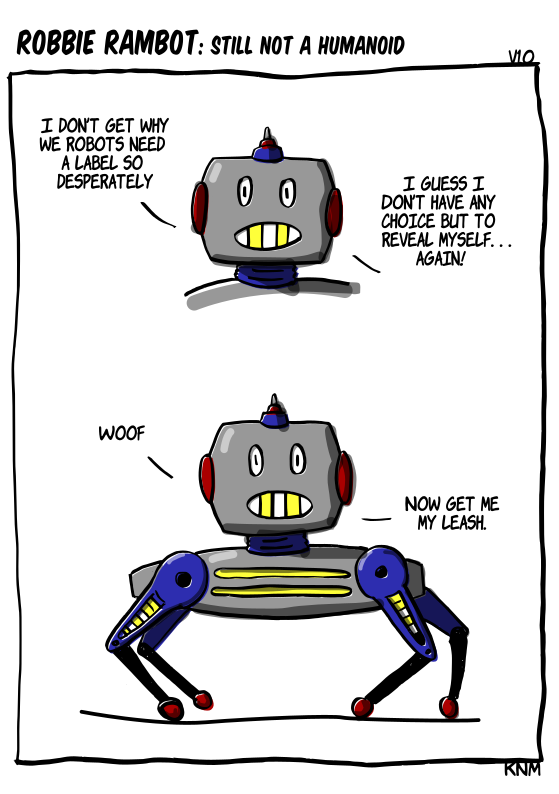

[{width=100}](robbie_dog.md)

*At the European Robotics Forum they kept on talking about a humanoid robotic development strategy, but how about their companions huh!? They need some love and attention too!* 

*Enjoy!*

<!-- more -->

![A two-panel comic titled "Robbie Rambot: Still Not a Humanoid." In the first panel, a robot with a square head, red ear-like sides, and yellow teeth-like grill says, "I don't get why we robots need a label so desperately." Then, it adds, "I guess I don't have any choice but to reveal myself… again!" In the second panel, the same robot's full body is shown—it's a quadrupedal robot resembling a mechanical dog. It says "WOOF" and follows with, "Now get me my leash." The comic humorously reveals that although the robot dislikes labels, it actually resembles a robotic dog.](images/robbie_dog_lowres.png)

Give comments here below for feedback :robot:
