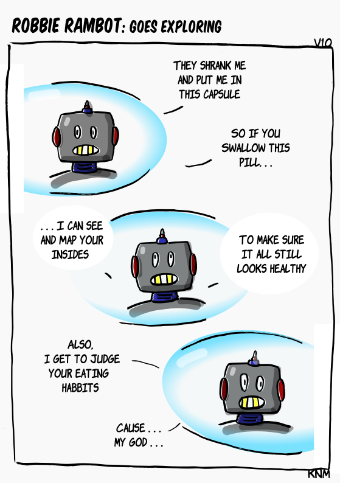

[{width=100}](robbie_exploration.md)

*A Robbie dedicated to colorectal cancer awareness months and my [latest blogpost](https://knmcguire.github.io/blog/2025/03/29/when-the-doctor-stops-smiling/). There is still robotics that can be actually do potentially good!* 

<!-- more -->

Give comments here below for feedback :robot:
