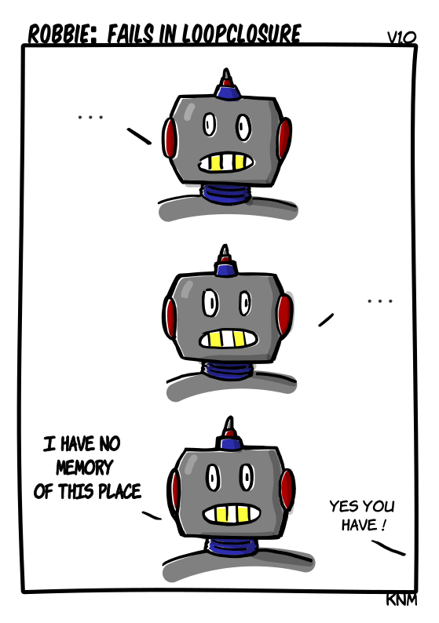

[{width=100}](robbie_loop_closure.md)

*So I've started with this webcomic that originated form the FOSDEM Robotics and Simulation mascotte Robbie (bitcraze wrote a [blogpost](https://www.bitcraze.io/2025/02/fosdem-25/) about this event with a picture). I will have a more indepth blogpost coming up about this journey, but first...meet Robbie!*

<!-- more -->

What do you think? I'm planning too release one of these every week at Sunday, so there are some better od ones coming up for sure :wink:
