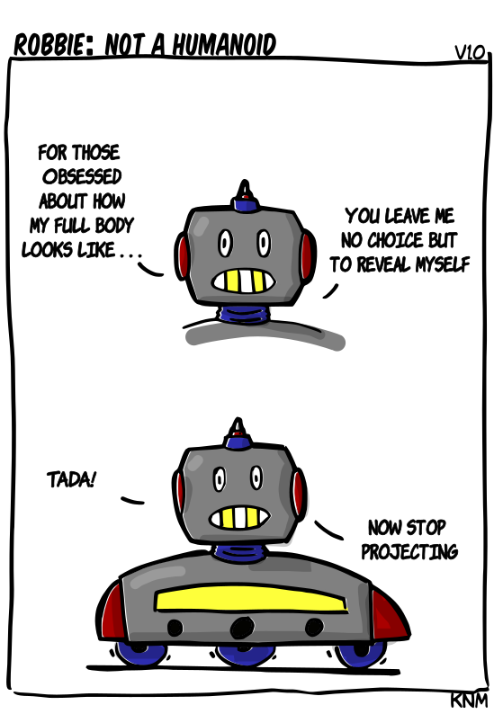

[{width=100}](robbie_not_humanoid.md)

*As a robotics developer I feel that now there is an unrealistic image of robots that must be met by modern society. Mobile robots are robots too!* 

*Enjoy!*

<!-- more -->

Give comments here below for feedback :robot:
