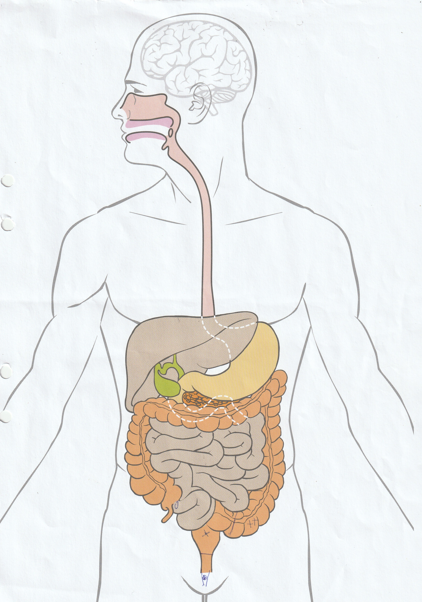

[{width=100}](when_the_doctor_stops_smiling.md)

*It's the end of colorectal awareness month of March 2025. Almost 2 years ago, I got diagnosed with stage 3 rectal cancer at just 33 years old. I've luckily (so far) seemed to have responded well on treatment, but since then I want to make you all aware. Early onset colorectal cancer is more and more common these days, and I had no idea. So here the story of me getting the first result at my colonoscopy, that I wished I read myself dealing with those initial symptoms. There are some details in there but it shouldn't be too TMI, but the subject might be tough.* 

<!-- more -->
It was my first time getting a colonoscopy, like many of us at 33. I had to eat a low-fiber diet for a week and fast for a day while taking Picoprep, a substance that forces your colon to be completely empty. I traveled to Lund, Sweden, by bus to the clinic, which was just a 30-minute ride. As nervous as I had been the week before, I felt relatively okay now—mostly wanting to eat again because fasting for an entire day is tough! But it was doable, including the "toilet party" experience. Many have said that Picoprep is disgusting and that the prep day is an ordeal, but I didn’t find it that bad. More importantly, I wasn’t worried about the outcome—we were just doing this as a precaution, and I completely trusted my doctor, who had reassured me that my symptoms were likely due to hemorrhoids. My only real concern was the anesthesia, as I had never been sedated for any procedure before.

At the clinic, I waited in the reception area. There was an older woman, likely in her late 60s, and a younger woman I assumed was her daughter. They were speaking a language I didn’t understand, but it sounded Eastern European. The older woman was called in before me. A few minutes later, a nurse hurried back into the waiting room, asking if the daughter could come with her. Apparently, her mother didn’t speak English or Swedish, and they needed to explain something to her. The daughter followed the nurse, and suddenly, I was alone. That’s when my nerves started to creep back in.

About ten minutes later, a nurse called my name. Luckily, she spoke English well enough for me to understand what to do. I was asked to undress but could keep my top on. They gave me disposable underwear, which felt like the fabric of those small airplane pillows on long-haul flights. Once I changed, I took a moment to look at the equipment they’d be using. There was a long black tube and a couple of screens displaying the camera feed. Seeing it made me even more nervous, anxious even.

The nurse returned with a colleague and asked me to lie on my side on the examination bed, which was covered with the same disposable material as my pants. As she prepped my arm and gave me a small dose of morphine, the doctor performing the colonoscopy entered. He had a big smile and introduced himself as Dr. Jacobsson, but I could call him Eric[^1]. "Since I'll know all of your darkest secrets, we can be on a first-name basis," he joked. That helped me relax a little.

[^1]: This is a fake name ofcourse.

Then the nurse prepared the Propofol, the sedative I had been dreading the most. Once she injected it, I watched the liquid flow through the tube into my arm. A warm sensation started at the injection site and quickly spread up to my head.

I instinctively started counting backward from ten—not because they told me to, but because it felt like something I should do. I didn’t make it past seven. As the warmth reached my head, I was out.

I have a vague memory of waking up slightly mid-procedure, murmuring, "Hey, I’m awake..." before drifting off again, likely thanks to an extra dose of Propofol. When I finally woke up, they were wheeling me into another room. It was a surprisingly gentle awakening—like waking up naturally after a good night’s sleep, without an alarm.

After resting for a bit, I changed back into my clothes and headed to the small cafeteria. I grabbed a cup of tea and a big cookie—I was starving. An older woman at a nearby table struck up a conversation. She told me she had the colonoscopy because a routine stool test detected microscopic blood, but her results had come back clear. I wasn’t particularly focused on my own results yet; I was mostly just dreaming about my first proper meal in two days. Still, hearing her story reassured me a little.

Then one of the nurses from the procedure room entered and told me the doctor was ready to discuss my results. She hesitated before asking, "Is your partner here?" He wasn’t—things had moved faster than expected. She paused but then said, "Alright, come with me to see Dr. Jacobsson."

As I walked into his office, I joked, "Seems like you needed more anesthesia to keep me under," referring to my brief awakening. I expected a smile from the usually humorous doctor, but his face was serious.

"Please sit down," he said. That’s when it hit me—something was wrong.

Once we were seated at the same level, he looked me in the eye. "We found something." He pulled out a diagram of the intestines and placed a large X over the rectum. "There’s a sizable lesion here—about five centimeters." He then marked two smaller Xs lower in the sigmoid colon. "We also found two polyps here."

He turned back to me, and I lost it. Tears streamed down my face, and from that point, it was hard to process anything else he said. The only things I clearly remember were that I would be transferred to public hospital care and needed a whole bunch of urgent blood tests. 

I left his office with a handful of papers. My partner was waiting for me in the reception area. He smiled when he saw me—until he noticed my puffy face. His expression shifted to shock. I hugged him tightly, and he held me as I cried some more. By the time we got to the car, I had cried myself out—at least for the moment. Instead, I was on my phone, looking for the nearest lab to get the blood tests out as soon as possible.

A few weeks later, the official diagnosis confirmed what Dr. Jacobsson hadn’t explicitly said: I had rectal cancer.

That was almost 2 years ago—May 2023. I still remember that moment in the clearest detail, as if my brain took a snapshot. Getting a cancer diagnosis is one of the most traumatic experiences a person can go through, and nothing prepares you for it. I was young, a little overweight but moderately active, and drank alcohol occasionally—certainly less than I did in my student days. I wasn’t concerned at all. Colorectal cancer is supposed to be an old man’s disease, right?

But I learned the hard way that this disease sees no gender and is the fastest-growing cancer among young people. Why? Doctors still don’t know for certain. Diet, alcohol, weight—they all play a role, but there’s no single "smoking gun" like smoking and lung cancer.

I managed to get through radiation and treatment, and , the tumor responded well enough that I don’t require surgery—at least not yet. The tumor was five centimeters (about the size of a donut), had affected eight lymph nodes, and might have spread to my uterus, but not to distant organs. I now undergo scopes and scans every three months, plus an annual CT scan. So far, so good. But I was dangerously close to a stage 4 diagnosis, which has only a 15% survival rate compared to the 70%+ survival rate of earlier stages.

Looking back, it’s almost ridiculous how nervous I was about the colonoscopy itself, which turned out to be completely manageable—far from the "ordeal" some had described. If I had known what was coming, I wouldn’t have delayed it for work trips or convenience. They could have caught it even earlier. I got the drawing the doctor drew with me, and now looking at it, I could hardly see the Xs he drew, but back then, they's Xs felt huge to me. It's crazy how that goes with memory

My doctor and I were both convinced my symptoms were nothing serious, simply because I was young. But colorectal cancer is rising in young people. Since March is Colorectal Cancer Awareness Month, I’m sharing my story in the hope that it encourages others to take symptoms seriously. If you experience blood in your stool, mucus, diarrhea, constipation, or unexplained weight loss, don’t dismiss it. Talk to your doctor. Even many physicians aren’t fully aware of how much this disease is affecting younger people. Early detection drastically improves outcomes.

