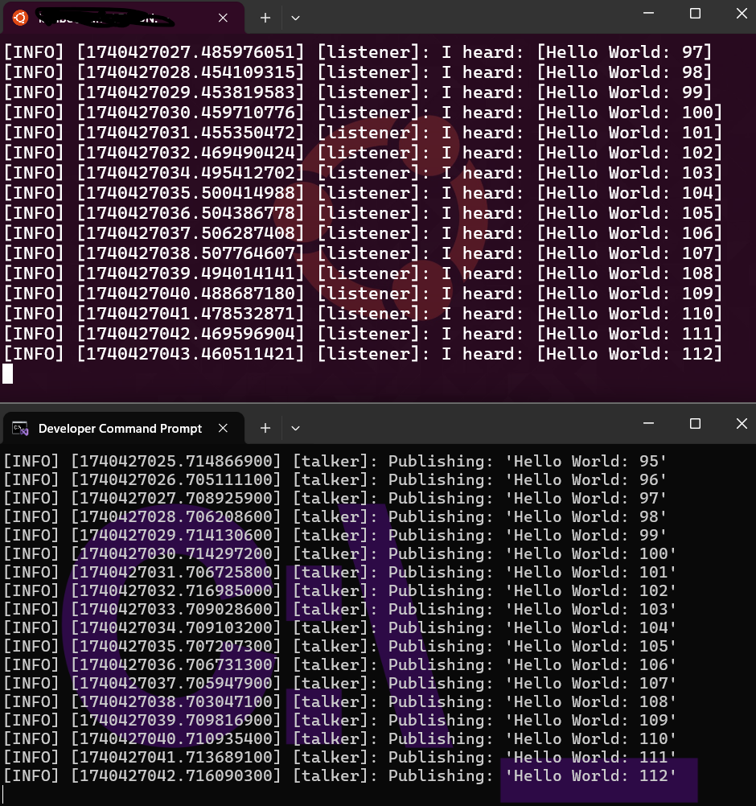
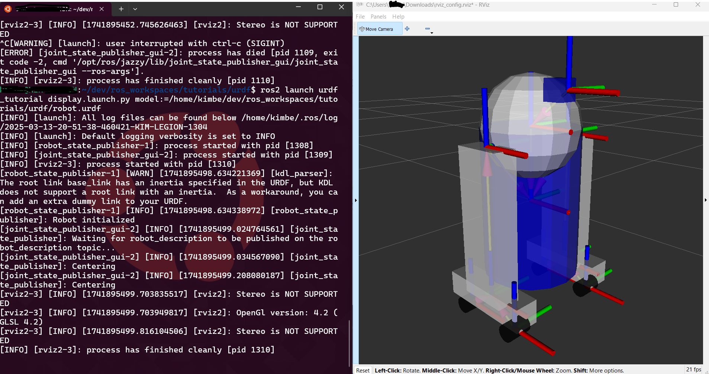

[{width=100}](windows_with_robotics.md)

_Yes, I am a little bit mad. Why the hell do I torture myself to get development to work on Windows... well, I tried to trace back the journey for robotics development, where I desperately tried to hang on to Windows, but had to settle for a dual boot, only to slowly return to give development on Windows a chance again._

_Enjoy! (I hope :wink:)_

<!-- more -->

## 2007 - 2014: Single boot - Win XP/7

I can't believe it myself, but I spent my entire university studies, both bachelor's and master's, with a full Windows laptop as my computer. I started with Industrial Design Engineering in 2007, so it made sense. At that time, Windows was superior for all things Adobe, and even 3D CAD SolidWorks worked only on Windows. MacOS had some catching up to do to become the graphic design powerhouse it is today.

As soon as I did my bridging course to Mechanical Engineering and finally my Master's in Bio-Mechanical Engineering, things got a bit more difficult. Still, I hung on, as we mostly scripted in Matlab, and some Java and even Prolog still worked okay on Windows.

I remember rolling my eyes when someone evangelized Ubuntu to me as the superior OS, saying you can do everything that Windows does. Sure, there are alternatives like Octave instead of Matlab, or Gimp instead of Photoshop, but then it was not a 1 to 1 replacement for sure (Gimp still isn't to this day). I didn't feel the urge to switch until I had to work with ROS for my final Master's project in 2014. Luckily, they had a separate PC for me to work on, which had Ubuntu 14.04 with ROS 1 Indigo, so I could keep my trusty Windows laptop for the rest.

However, I still have traumas from the C++ course that I had to do on Windows, which resonates with me to this day (why, Visual Studio, why!).

## 2015 - 2019: Dualboot - Win 8 and Ubuntu 14.04/16.04

When I started my PhD in 2015, after weeks of trying to set up a proper development environment for embedded C with Cygwin, both the lab engineer and I mentally broke and decided to install a dual boot on my university laptop. I couldn't find one-on-one replacements for graphic programs like Adobe, gaming was superior on Windows (yes, I did use my university laptop for that), and even high rendering simulations ran better on Windows.

Although I was limited by Nvidia cards (since I hoped to do more with deep learning and CUDA at some point), this forced me to deal with the dual boot and restart my computer whenever I needed to do any development. Due to my painful experience with C++ development in Visual Studio, I didn't want to try setting that up again. This was my state until after my PhD ended: dual boot of Windows and Ubuntu, side by side. Not ideal, but it worked for most of my use cases, despite the loss of drive space for both OSes and the constant need to reboot to switch from one to the other.

As a PhD student, you settle for what works and avoid deviations that could potentially waste time. "You don't have time for that! Now go write your journal papers."

## 2019 -2022: Dualboot - Win 10 (with wsl1) and Ubuntu 18.04/20.04

It wasn't until my time at Bitcraze, almost five years later, that I gave it another try. For Python development, I tested it out on Windows to ensure the Crazyflie Python library and cfclient were working before every release. I was surprised that it worked pretty well on Windows. So, I found myself on the 'dark side' of the computer (aka Windows, depending on who you ask) more and more for Python development. However, I still had to move back to the Ubuntu part quite often for C development until my colleagues told me about the Windows Subsystem for Linux (WSL).

At that time, WSL was still a development feature on Windows 10, and the GUI feature was quite non-existent, requiring a lot of hacking for subpar results. But it allowed me to compile the C firmware of the Crazyflie, copy it to the Windows part, and flash the Crazyflie with the Python cflib. I even wrote a [blogpost about that state on the bitcraze website](https://www.bitcraze.io/2021/04/transitioning-back-to-windows-development/). Suddenly, development on Windows wasn't as painful as it used to be. 

However, the early versions of WSL and WSL2/G on Windows 10 were quite buggy. So, for some heavy-duty development, I still had a dual boot with Ubuntu available. Since 2022, I started going back to ROS and transitioned to ROS 2, which was still very much only suitable for Ubuntu (although I tried to compile [compile Crazyswarm2 for Windows ](https://github.com/IMRCLab/crazyswarm2/issues/1) at one point and half succeeded). This was still very necessary, especially in combination with Gazebo.

## 2022 - 2024: Dualboot - Win 11 (with WSL2) and POP!OS 22.04

At one point, I upgraded my laptop, so now it had the hardware to run Windows 11. I tried out WSL2 there, which had GUI support out of the box and worked much better than before. I also switched from Ubuntu to POP!OS, which had much better graphics card support and actually seemed to work quite well. The problem was that POP!OS only had double graphic card support for Intel and Nvidia combos. So guess what kind of laptop I got? A Ryzen with an AMD integrated graphics card and a second Nvidia GPU. Just the one that is unsupported for POP!OS multi-GPU support. I need to pick out my laptops better next time. But still, if I needed to do heavy-duty Gazebo and ROS development, I could switch to Ubuntu for the day, and I liked POP!OS quite a bit. However, once it was time for the world to switch to Ubuntu 24.04, it took POP!OS forever to do so (and it still hasn't come out), and I was not able to try out the latest ROS Jazzy distro.

So that is when I started to use ROS more and more on WSL2 and was able to run ROS Jazzy on a 24.04 version of WSL2 before I was able to try it on my Linux side, even though it wasn't officially supported. With USBipd to connect a communication dongle to the subsystem and remote access from VSCode, it worked out for most of my use cases. There is only one point remaining, and that was the janky GUI support from WSL2. The GUIs that popped up from WSL2 had a very slow FPS, couldn't resize properly, and didn't have proper mouse integration support. Moreover, I just couldn't, for the life of me, make WSL2 select my super fancy Nvidia graphics card on my Lenovo Legion Laptop for just RVIZ2 and Gazebo alone, only for the full container. Things were not yet ideal, but still, it remained workable.

## 2025: Single boot: Windows 11 with WSL2

After my time at Bitcraze, during my 'mini-retirement', I wanted to reinstall my computer to have a nice fresh start, but what to do? I've been bothered by the lack of disk space (for gaming), not as appalled as much by C and ROS development on Windows with the help of WSL2, and hardly was using the Ubuntu of the dual boot anymore. There were just some graphic card support issues remaining. But, especially when the ROS team announced that they were changing up their [installation guidance for Windows installation of ROS 2](https://discourse.ros.org/t/upcoming-switch-of-windows-installation-to-pixi-conda/41916) I decided to go "back to my roots" and go full on Windows again! I am putting a lot of trust in this promised improvement, but luckily I don't have anyone relying on me to perform. And if it doesn't work out, I'll just get a second laptop for Ubuntu-only stuff (or use my Raspberry Pi 5, works pretty good with Ubuntu 24.04 these days!). No harm done! Only my pride on the line.

So once I got a fresh install of Windows 11, the absolute first thing I've tried out was the [new install instructions for ROS 2 on windows](https://github.com/ros2/ros2_documentation/pull/4989). Unfortunately, since the binaries/zip files weren't available, I went straight for the hardcore source install. They are now recommending using Pixi as the environment, which before it was only Miniconda. Sure, I had to wait half a day for all the essential ROS 2 packages to build and install, and fix a couple of errors here and there, but my god, what a breeze. Since it is now possible with the pixi.toml file to set up the environment exactly as it is supposed to, I had it working in a day! And check this out... here is a picture of ROS 2 Jazzy on WSL2 as listener and ROS 2 Jazzy on Windows 11 natively as talker! I felt just like a proud parent when this happened :blush:

But how about the GUI issues? That was still putting me off. Not only the GPU access issues and the low FPS of the browser refresh rate, but also the fact that sometimes, the WSL GUI just disappears and I can't retrieve it, and the only way to access it is to restart WSL2... Well, not anymore! Here a robot description ROS launched from WSL Ubuntu 24.04 and RVIZ2 from Windows with none of that issue. The only issue, of course, is the model will need to be fully described from the robot description, so if there is a model (STL or Collada) referred to in the robot description, you'll get an error, of course, since the native Windows RVIZ2 can't find it. Still room for improvement.

## 2026 - ...: Full Windows without WLS2?

I see many possibilities here to make ROS running on Windows not as painful as it used to be, and maybe even better? Here I showed RVIZ2, but how about running Gazebo from Windows while running SLAM packages from WSL2? Or maybe a package that handles the USB support so I no longer have to use USBIPD? Or... run everything from Windows natively? One thing is for sure, I'll like to use Pixi for everything now since it was an eye opener after I tried out the new ROS2 draft installation instructions for Windows. I'm glad that the ROS2 dev team decided to not fully give up on Windows, since there seem to be many that actually rely on this (104 people answered [the survey ](https://discourse.ros.org/t/windows-survey-results/39502) they sent out). Now the [rolling ROS 2 documentation are out for Windows 10](https://docs.ros.org/en/rolling/Installation/Windows-Install-Binary.html) with the new instructions, but this works on Windows 11 as well, and Jazzy with just a couple of bug fixes here and there. Also something I wasn't aware of, is the great work the Robostack community for condapackages for windows! It's such an improvement for those who struggled with it before. 

All in all, everyone can pick and choose which OS works best for them. I promise I won't roll my eyes if you say that you'd rather use MacOS or Ubuntu, however, I will still do that if someone claims it to be superior. This is so personally dependent that there is currently not an OS for all, at least for now. In my case, I play a lot of games on my computer, and I do quite some graphical design and the occasional game development on the same machine, so that means: lots of disk space (no dual boot) and good graphic card support (Windows x Nvidia). Ideally, I don't want to switch if I'd like to do any ROS or simulation development on the side. For me, ideally, I'd like to do that with a Windows machine, but if you have different requirements for your computer, then other OSes might be better for you. I just like Windows for most of my use cases better, and I'm not the only one.