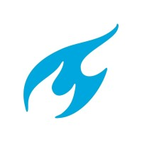
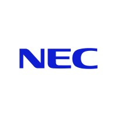
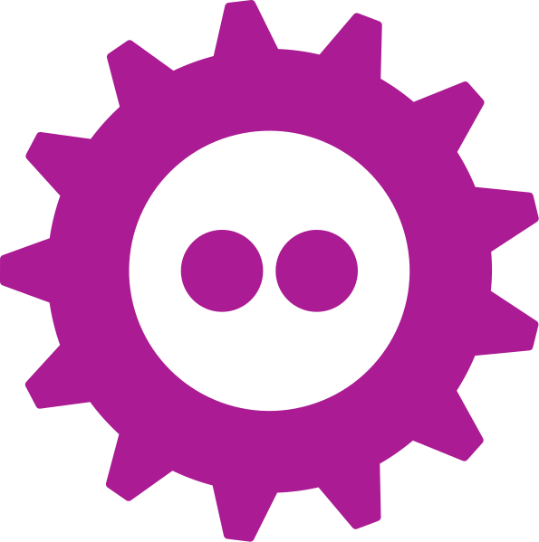
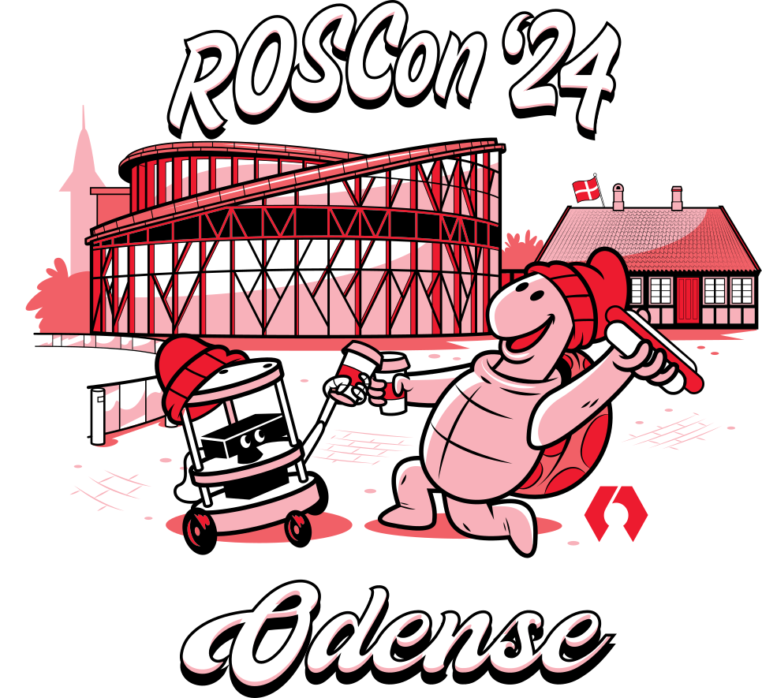
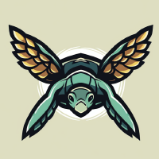

{width=200 .center}

**Kimberly N. McGuire, PhD**
___

Hi , I'm Kimberly! I am an independent roboticist with a background in aerial robotics and embedded systems. With Dutch and American roots, I am currently based in Malmö, Sweden. I completed my PhD in swarm robotics in 2019 and worked with the Aerial Robot Crazyflie at Bitcraze until 2024. I am also an experienced speaker at conferences and podcasts, and have occasionally lectured. Presently, I am engaged in a couple of robotic simulation projects.
   
      

**
  Currently available for 
**    
● Short-term Contracts 
●  Strategy Consultation
●  Speaking & Writing
● Research & Education
●
   
     
[My CV :fontawesome-solid-file-lines:](/files/knmcguire_cv_20250410.pdf)   
[My Portfolio :fontawesome-solid-folder-open:](/projects) 
   
[For Enquiries :fontawesome-solid-envelope:](mailto:&#107;&#110;&#109;&#099;&#103;&#117;&#105;&#114;&#101;&#114;&#111;&#098;&#111;&#116;&#105;&#099;&#115;&#064;&#103;&#109;&#097;&#105;&#108;&#046;&#099;&#111;&#109;)    
___

## Highlights :fontawesome-solid-star:

{{ custom_button("Science Robotics Paper :fontawesome-solid-pen:", "https://robotics.sciencemag.org/content/4/35/eaaw9710", color="gray") }}

{{ custom_button("Robotics Developer Day Talk :fontawesome-solid-person-chalkboard: :fontawesome-solid-trophy:", "https://youtu.be/rtgt9Z1cPas", color="teal") }}

:fontawesome-solid-trophy: _Best Speaker Award_

___

## Skills :fontawesome-solid-hammer:

{{ list_unique_labels(lower_limit=2, star_threshold=2, small_star_threshold=1) }}

_:fontawesome-solid-star: Expert :fontawesome-regular-star: Proficient_ 

[And many more...](/projects)
 
___

## Experience :fontawesome-solid-briefcase:

<!--{ width="100" }{ width="100" }{ width="100" }-->

* _2025 - now_:&nbsp; **Contractor** _Self-Employed_ :se:

* _2022 - 2024_: **Robotics Engineer** _Bitcraze AB_ :se:

* _2019 - 2022_: **Embedded Developer** _Bitcraze AB_ :se:

* _2015 - 2019_: **PhD Researcher** _TU Delft_ :nl:

* _2013 - 2014_: **Intern Comp. Photography** _NEC_ :jp:

[Check out my portfolio...](/projects)
 

___

## Communities :fontawesome-solid-users:
<!--{ width="100" }{ width="100" }{ width="100" }-->

* _2024 - now_:&nbsp; **Diversity Co-chair** [ROSCon 2024](https://roscon.ros.org/2024/) :dk:

* _2023 - now_:&nbsp; **Co-lead** [Aerial ROS interest group](https://github.com/ros-aerial) :fontawesome-solid-globe:

* _2023 - now_:&nbsp; **Member level 2** [Toastmasters](https://www.toastmasters.org/) :se:

* _2015 - 2018_: **Organisation** RoboCup Jr. :nl:

[Other media appearances...](/media)
 

___

## Education :fontawesome-solid-user-graduate:

* _2019_: **PhD Aerospace Engineering**, _TU Delft_ :nl:

* _2014_: **MSc Mechanical Engineering** , _TU Delft_ :nl:

* _2011_: **BSc Industrial Design Eng.**, _TU Delft_ :nl:

___

{{ custom_button("A list of projects I've worked on :fontawesome-solid-diagram-project:", "/projects", color="teal") }}

{{ custom_button("Talks, Publications and Podcast appearances :fontawesome-solid-microphone:", "/media", color="gray") }}

{{ custom_button("Personal Blogs and Robbie Rambot comic :fontawesome-solid-robot:", "/blog", color="teal") }}