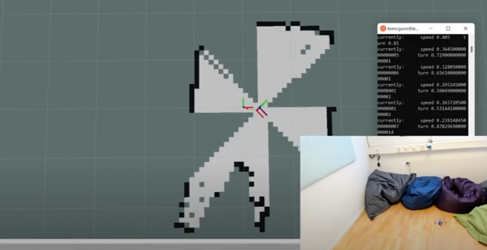
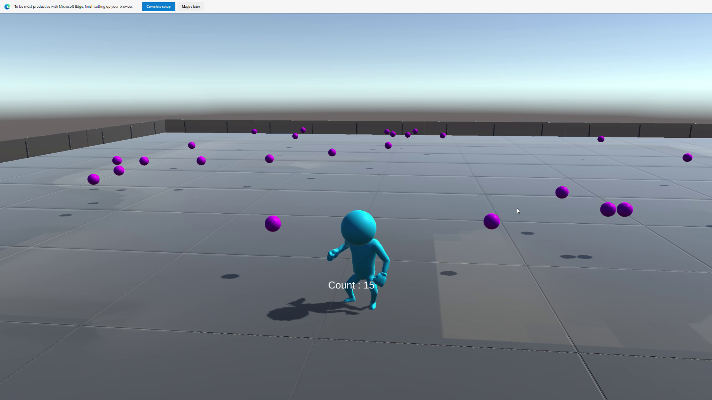
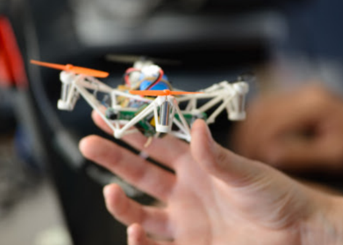
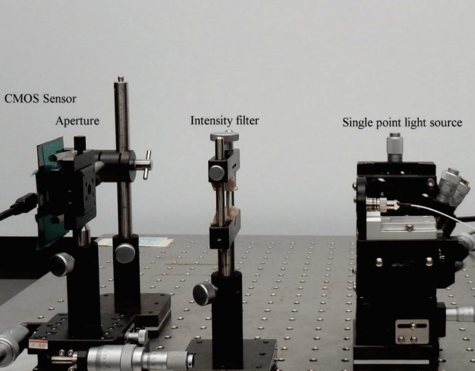
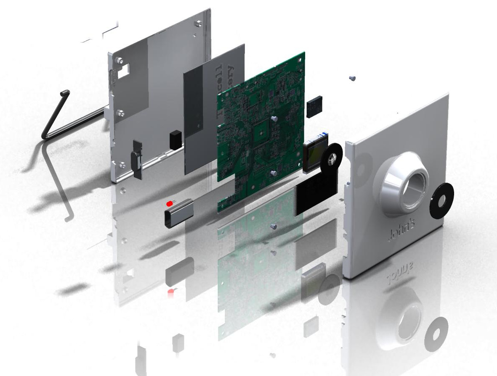

___

## ROS 2 Navigation with a nano-quadcopter 
_2022 - 2024 - Bitcraze_

{ width="300" }

During this project, I've connected a nano quadcopter with the ROS 2 framework through the Crazyswarm2 project. This allowed me to connect it to simulation, navigation packages like NAV2, or simpler mapping and navigation package strategies.

**Related Links**

* Blogposts: [:fontawesome-solid-file-lines:](https://www.bitcraze.io/2024/09/crazyflies-adventures-with-ros-2-and-gazebo/) [:fontawesome-solid-file-lines:](https://www.bitcraze.io/2022/10/crazyswarm2-development/) [:fontawesome-solid-file-lines:](https://www.bitcraze.io/2022/08/crazyflie-ros2-summer-update/) 
* Videos: [:fontawesome-solid-film:](https://youtu.be/NiQq8sAlAz4?si=4YCacfYtxWh7LLSc) [:fontawesome-solid-film:](https://youtu.be/j3qNuV6ieGQ) 

* ROSCon 2022 Presentation [:fontawesome-solid-film:](https://vimeo.com/showcase/9954564/video/767140197)  
* Robotics Developer day 2024 [:fontawesome-solid-film:](https://youtu.be/rtgt9Z1cPas) :fontawesome-solid-trophy:

    {{ skill_label("Python") }}
    {{ skill_label("C") }}
    {{ skill_label("Gazebo") }}
    {{ skill_label("Webots") }}
    {{ skill_label("ROS") }}
    {{ skill_label("Deliberation") }}
    {{ skill_label("Pop_OS!") }}
    {{ skill_label("Windows") }}
    {{ skill_label("WSL2") }}
    {{ skill_label("SLAM") }}
    {{ skill_label("RTOS") }}
    {{ skill_label("Aerial") }}
    {{ skill_label("Mobile") }}
    {{ skill_label("CAD") }}
    {{ skill_label("Simulation") }}
    {{ skill_label("Crazyflie") }}

______

## Robotic simulators of nano-quadcopters
_2021 - 2022 - Bitcraze_

{ width="300" }

I've built multiple models for the nano-quadcopter, the Crazyflie, creating a low-poly Collada model suitable for multi-quadcopter simulation. These have been implemented with collision models, propeller physics, and control in both Webots and the new Gazebo.

**Related Links**

* Blogposts  [:fontawesome-solid-file-lines:](https://www.bitcraze.io/2021/12/simulation-possibilities/) [:fontawesome-solid-file-lines:](https://www.bitcraze.io/2022/03/updates-on-simulation-work/) 
* ICRA 2023 Workshop on Aerial Robotics Simulation: [:fontawesome-solid-arrow-up-right-from-square:](https://imrclab.github.io/workshop-uav-sims-icra2023/)
* IEEE Robotics & Automation journal paper: [:fontawesome-solid-file-lines:](https://ieeexplore.ieee.org/document/10665978
) 

    {{ skill_label("Blender") }}
    {{ skill_label("Python") }}
    {{ skill_label("C") }}
    {{ skill_label("C++") }}
    {{ skill_label("Gazebo") }}
    {{ skill_label("Webots") }}
    {{ skill_label("Ubuntu") }}
    {{ skill_label("Windows") }}
    {{ skill_label("Aerial") }}
    {{ skill_label("CAD") }}
    {{ skill_label("Simulation") }}
    {{ skill_label("Crazyflie") }}

<!--a href="https://www.bitcraze.io/author/kimberly/"><button style="background-color: #E8E8E8;
        border: 2px solid black;
        color: black;
        padding: 15px 32px;
        text-align: center;
        text-decoration: none;
        display: inline-block;
        font-size: 16px;
        width: 100%; 
        cursor: pointer">My written blogpost at Bitcraze  :fontawesome-solid-arrow-up-right-from-square: </button></a>-->

___

## Game development learning path
_2020 - 2021 - Personal_

{ width="300" }

During the height of the covid pandamic, I've taken many courses on game development, namely Unity and Godot. Here I've learned the basics of the game engines and followed the programming pathway such that I could create some simple 3D games and experience mixed reality development. It gave me a better understanding of the mechanics of games and robotic simulation as well.

**Related Links**

* Unity profile and play pages: [:fontawesome-brands-unity:](https://learn.unity.com/u/6026923eedbc2a0021214d0a?tab=profile/) [:fontawesome-brands-unity:](https://play.unity.com/en/user/e4945c49-4457-4b95-bf13-0ce93eeb07bc) 

        {{ skill_label("C#") }}
        {{ skill_label("Godot") }}
        {{ skill_label("Unity") }}
        {{ skill_label("Game Dev") }}
        {{ skill_label("Mixed Reality") }}
        {{ skill_label("Inkscape") }}
        {{ skill_label("Blender") }}
        {{ skill_label("Graphic Design") }}

___

## Swarm Gradient Bug Algorithm
_2018 - 2019 - TU Delft_

{ width="300" }  
_(Guus Schoonewille, TU Delft)_

I've researched how a swarm of tiny quadcopters can autonomously fly indoors without external positioning help. This posed a significant challenge, requiring individual quadcopters to fly independently and the swarm to communicate for coordination and avoidance. To address this, I developed SGBA, the Swarm Gradient Bug Algorithm.

**Related Links**

* Blogpost:  [:fontawesome-solid-file-lines:](https://www.bitcraze.io/2019/10/enabling-swarm-exploration/) 
* Science Robotics Publication [:fontawesome-solid-file-lines:](https://www.science.org/doi/10.1126/scirobotics.aaw9710) 
* Video Press release [:fontawesome-solid-film:](https://youtu.be/IgMKiIEbfN8?si=oXxMp5Elx2btogSD)

        {{ skill_label("C") }}
        {{ skill_label("RTOS") }}
        {{ skill_label("ESP") }}
        {{ skill_label("Deliberation") }}
        {{ skill_label("ROS") }}
        {{ skill_label("Gazebo") }}
        {{ skill_label("ARGoS") }}
        {{ skill_label("Matlab") }}
        {{ skill_label("Python") }}
        {{ skill_label("Ubuntu") }}
        {{ skill_label("Windows") }}
        {{ skill_label("Aerial") }}
        {{ skill_label("Swarm") }}
        {{ skill_label("Mobile") }}
        {{ skill_label("Computer Vision") }}
        {{ skill_label("CAD") }}
    {{ skill_label("Simulation") }}
    {{ skill_label("Crazyflie") }}

___

## Autonomous pocket drone for Swarm Exploration
_2015 - 2018 - TU Delft_

{ width="300" }

Back in 2015, there was no standard platform for autonomous swarming for indoor exploration. Until the folks at Bitcraze released the right expansion decks, I had to develop my own platform for this by combining different modules together, developed internally by the engineers from MAVlab, TU Delft.

**Related Links**

* Final Experiment Video: [:fontawesome-solid-film:](https://youtu.be/yX3RoUi9D-g)   
* IEEE Robotics and Automation Letters publication:    [:fontawesome-solid-file-lines:](https://ieeexplore.ieee.org/stamp/stamp.jsp)
* PhD Dissertation: [:fontawesome-solid-file-lines:](https://repository.tudelft.nl/islandora/object/uuid:48ed7edc-934e-4dfc-b35c-fe04d55caee1?collection=research)

        {{ skill_label("C") }}
        {{ skill_label("GPIO") }}
        {{ skill_label("Bluetooth") }}
        {{ skill_label("ESP") }}
        {{ skill_label("Optical Flow") }}
        {{ skill_label("Paparazzi") }}
        {{ skill_label("Matlab") }}
        {{ skill_label("FreeCAD") }}
        {{ skill_label("3D printing") }}
        {{ skill_label("Ubuntu") }}
        {{ skill_label("Windows") }}
        {{ skill_label("RTOS") }}
        {{ skill_label("Aerial") }}
        {{ skill_label("Computer Vision") }}
        {{ skill_label("State Estimation") }}
        {{ skill_label("Control") }}
        {{ skill_label("CAD") }}
    {{ skill_label("Simulation") }}

<!--a href="/projects/phd"><button style="background-color: #555555;
        border: none;
        color: white;
        padding: 15px 32px;
        text-align: center;
        text-decoration: none;
        display: inline-block;
        font-size: 16px;
        width: 100%; 
        cursor: pointer">PhD Disseration on Indoor Swarm exploration with Pocket Drones :fontawesome-solid-arrow-up-right-from-square:</button></a-->

___

## Binocular Vision Stabilization
_2014 - TU Delft_

{ width="300" }

I've developed a neural network model for the stabilization of the cameras of a binocular robotic head, based on the human cerebellum. This is based on the theory that the cerebellum processes a massive amount of sensor information and filters out the most important data for the task. This enabled the robot to more smoothly track the marker despite external disturbances, inspired by mechanisms in our own brain

**Related Links**

* MSc Final Thesis: [:fontawesome-solid-film:](https://repository.tudelft.nl/islandora/object/uuid:3fb881d2-9701-4f1c-96a6-f6fca74aeec8?collection=education)  

        {{ skill_label("C++") }}
        {{ skill_label("Matlab") }}
        {{ skill_label("solidworks") }}
        {{ skill_label("ROS") }}
        {{ skill_label("Gazebo") }}
        {{ skill_label("OpenCV") }}
        {{ skill_label("Optical Flow") }}
        {{ skill_label("Neural Networks") }}
        {{ skill_label("Ubuntu") }}
        {{ skill_label("Simulink") }}
        {{ skill_label("Computer Vision") }}
        {{ skill_label("Mobile") }}
        {{ skill_label("State Estimation") }}
        {{ skill_label("Control") }}
        {{ skill_label("CAD") }}
    {{ skill_label("Simulation") }}
    {{ skill_label("Keras") }}

___

## Coded Infrared-Cut Filter 
_2013 - 2014 - NEC_

{ width="300" }

As an intern at the NEC Corporation in Tokyo, Japan, I worked in the Information and Media Processing Labs. I focused on validating a novel high-sensitivity sensing method for computational photography. With a coded infrared cut filter, the concept could be used on regular security cameras to capture both images in the visual spectrum and infrared, which can be useful in low-light conditions.

**Related Links**

* Conference Paper at Springer CAIP conference: [:fontawesome-solid-file-lines:](https://link.springer.com/chapter/10.1007/978-3-319-23192-1_15)

        {{ skill_label("Matlab") }}
        {{ skill_label("Optical Physics") }}
        {{ skill_label("OpenCV") }}
        {{ skill_label("Computer Vision") }}
        {{ skill_label("Windows") }}

___

## Wearable timelapse camera
_2011 - TU Delft_

{ width="300" }

Before switching to Mechanical Engineering, I completed my final project in Industrial Design Engineering. John's Phone is a company that made extremely simple cellphones as an anti-movement to smart iPhones. As the next product in their line, I conceptualized the 'John's Camera,' a wearable timelapse camera that can be clipped on and record the user's day.

        {{ skill_label("solidworks") }}
        {{ skill_label("Industrial Design") }}
        {{ skill_label("Photoshop") }}
        {{ skill_label("Indesign") }}
        {{ skill_label("3D printing") }}
        {{ skill_label("Windows") }}
        {{ skill_label("CAD") }}

    {{ skill_label("Gimp") }}
    {{ skill_label("Docker") }}
    {{ skill_label("PX4") }}
    {{ skill_label("Blender") }}
    {{ skill_label("State Estimation") }}
    {{ skill_label("State Estimation") }}
    {{ skill_label("Optical Flow") }}
    {{ skill_label("Swarm") }}
    {{ skill_label("Keras") }}
    {{ skill_label("Neural Networks") }}
    {{ skill_label("Paparazzi") }}

